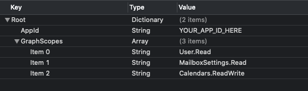

<!-- markdownlint-disable MD002 MD041 -->

Dans cet exercice, vous allez étendre l’application de l’exercice précédent pour prendre en charge l’authentification avec Azure AD. Cela est nécessaire pour obtenir le jeton d’accès OAuth nécessaire pour appeler Microsoft Graph. Pour ce faire, vous allez intégrer la [bibliothèque d’authentification Microsoft (MSAL) pour iOS](https://github.com/AzureAD/microsoft-authentication-library-for-objc) dans l’application.

1. Créez un nouveau fichier de **liste de propriétés** dans le projet **GraphTutorial** nommé **AuthSettings. plist**.
1. Ajoutez les éléments suivants au fichier dans le dictionnaire **racine** .

    | Clé | Type | Valeur |
    |-----|------|-------|
    | `AppId` | String | ID de l’application à partir du portail Azure |
    | `GraphScopes` | Tableau | Deux valeurs de chaîne `User.Read` : et`Calendars.Read` |

    

> [!IMPORTANT]
> Si vous utilisez le contrôle de code source tel que git, il est maintenant recommandé d’exclure le fichier **AuthSettings. plist** du contrôle de code source afin d’éviter une fuite accidentelle de votre ID d’application.

## <a name="implement-sign-in"></a>Implémentation de la connexion

Dans cette section, vous allez configurer le projet pour MSAL, créer une classe de gestionnaire d’authentification, puis mettre à jour l’application pour se connecter et se déconnecter.

### <a name="configure-project-for-msal"></a>Configurer Project pour MSAL

1. Ajoutez un nouveau groupe de trousseau aux fonctionnalités de votre projet.
    1. Sélectionnez le projet **GraphTutorial** , puis **signez les fonctionnalités de &**.
    1. Sélectionnez **+ capacité**, puis double-cliquez sur **partage de trousseau**.
    1. Ajoutez un groupe de trousseau avec la valeur `com.microsoft.adalcache`.

1. Contrôle cliquez sur **info. plist** , sélectionnez **ouvrir en tant que**, puis **code source**.
1. Ajoutez les éléments suivants à `<dict>` l’intérieur de l’élément.

    ```xml
    <key>CFBundleURLTypes</key>
    <array>
      <dict>
        <key>CFBundleURLSchemes</key>
        <array>
          <string>msauth.$(PRODUCT_BUNDLE_IDENTIFIER)</string>
        </array>
      </dict>
    </array>
    <key>LSApplicationQueriesSchemes</key>
    <array>
        <string>msauthv2</string>
        <string>msauthv3</string>
    </array>
    ```

1. Ouvrez **AppDelegate. Swift** et ajoutez l’instruction import suivante en haut du fichier.

    ```Swift
    import MSAL
    ```

1. Ajoutez la fonction suivante à la classe `AppDelegate`.

    :::code language="swift" source="../demo/GraphTutorial/GraphTutorial/AppDelegate.swift" id="HandleMsalResponseSnippet":::

### <a name="create-authentication-manager"></a>Créer le gestionnaire d’authentification

1. Créez un **fichier SWIFT** dans le projet **GraphTutorial** nommé **AuthenticationManager. Swift**. Ajoutez le code suivant au fichier.

    :::code language="swift" source="../demo/GraphTutorial/GraphTutorial/AuthenticationManager.swift" id="AuthManagerSnippet":::

### <a name="add-sign-in-and-sign-out"></a>Ajouter la connexion et la déconnexion

1. Ouvrez **SignInViewController. Swift** et remplacez son contenu par le code suivant.

    :::code language="swift" source="../demo/GraphTutorial/GraphTutorial/SignInViewController.swift" id="SignInViewSnippet":::

1. Ouvrez **WelcomeViewController. Swift** et remplacez la fonction `signOut` existante par ce qui suit.

    :::code language="swift" source="../demo/GraphTutorial/GraphTutorial/WelcomeViewController.swift" id="SignOutSnippet":::

1. Enregistrez vos modifications et redémarrez l’application dans Simulator.

Si vous vous connectez à l’application, vous devriez voir un jeton d’accès affiché dans la fenêtre sortie dans Xcode.


## <a name="get-user-details"></a>Obtenir les détails de l’utilisateur

Dans cette section, vous allez créer une classe d’assistance pour contenir tous les appels à Microsoft Graph et mettre à `WelcomeViewController` jour le pour utiliser cette nouvelle classe afin d’obtenir l’utilisateur connecté.

1. Créez un **fichier SWIFT** dans le projet **GraphTutorial** nommé **GraphManager. Swift**. Ajoutez le code suivant au fichier.

    ```Swift
    import Foundation
    import MSGraphClientSDK
    import MSGraphClientModels

    class GraphManager {

        // Implement singleton pattern
        static let instance = GraphManager()

        private let client: MSHTTPClient?

        private init() {
            client = MSClientFactory.createHTTPClient(with: AuthenticationManager.instance)
        }

        public func getMe(completion: @escaping(MSGraphUser?, Error?) -> Void) {
            // GET /me
            let meRequest = NSMutableURLRequest(url: URL(string: "\(MSGraphBaseURL)/me")!)
            let meDataTask = MSURLSessionDataTask(request: meRequest, client: self.client, completion: {
                (data: Data?, response: URLResponse?, graphError: Error?) in
                guard let meData = data, graphError == nil else {
                    completion(nil, graphError)
                    return
                }

                do {
                    // Deserialize response as a user
                    let user = try MSGraphUser(data: meData)
                    completion(user, nil)
                } catch {
                    completion(nil, error)
                }
            })

            // Execute the request
            meDataTask?.execute()
        }
    }
    ```

1. Ouvrez **WelcomeViewController. Swift** et ajoutez l’instruction `import` suivante en haut du fichier.

    ```Swift
    import MSGraphClientModels
    ```

1. Ajoutez la propriété ci-dessous à la classe `WelcomeViewController`.

    ```Swift
    private let spinner = SpinnerViewController()
    ```

1. Remplacez le code `viewDidLoad` existant par le code suivant.

    :::code language="swift" source="../demo/GraphTutorial/GraphTutorial/WelcomeViewController.swift" id="ViewDidLoadSnippet":::

Si vous enregistrez vos modifications et redémarrez l’application maintenant, une fois connecté, l’interface utilisateur est mise à jour avec le nom d’affichage et l’adresse de messagerie de l’utilisateur.
