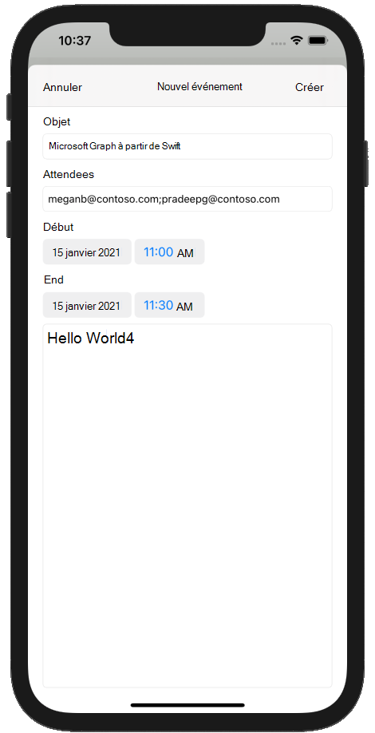

<!-- markdownlint-disable MD002 MD041 -->

Dans cette section, vous allez ajouter la possibilité de créer des événements sur le calendrier de l’utilisateur.In this section you will add the ability to create events on the user's calendar.

1. Ouvrez **GraphManager.swift** et ajoutez la fonction suivante pour créer un événement sur le calendrier de l’utilisateur.Open **GraphManager.swift** and add the following function to create a new event on the user's calendar.

    :::code language="swift" source="../demo/GraphTutorial/GraphTutorial/GraphManager.swift" id="CreateEventSnippet":::

1. Créez un **fichier de classe Cocoa Touch** dans le dossier **GraphTutorial** nommé `NewEventViewController` .Create a new **Cocoa Touch Class** file in the **GraphTutorial** folder named `NewEventViewController`. Choisissez **UIViewController dans** la **sous-classe du** champ.Choose **UIViewController** in the **Subclass of** field.
1. Ouvrez **NewEventViewController.swift** et remplacez son contenu par ce qui suit.Open **NewEventViewController.swift** and replace its contents with the following.

    :::code language="swift" source="../demo/GraphTutorial/GraphTutorial/NewEventViewController.swift" id="NewEventViewControllerSnippet":::

1. Ouvrez **Main.storyboard**.Open **Main.storyboard**. Utilisez la **bibliothèque pour** faire glisser un contrôleur **de vue** vers le storyboard.Use the **Library** to drag a **View Controller** onto the storyboard.
1. À **l’aide de la bibliothèque,** ajoutez une **barre de navigation** au contrôleur d’affichage.Using the **Library**, add a **Navigation Bar** to the view controller.
1. Double-cliquez sur **le titre dans** la barre de navigation et mettez-le à `New Event` jour.Double-click the **Title** in the navigation bar and update it to `New Event`.
1. À **l’aide de la bibliothèque,** ajoutez un élément de bouton **de** barre sur le côté gauche de la barre de navigation.Using the **Library**, add a **Bar Button Item** to the left-hand side of the navigation bar.
1. Sélectionnez le nouveau bouton de barre, puis l’inspecteur **d’attributs.**Select the new bar button, then select the **Attributes Inspector**. Change **title** to `Cancel` .Change **Title** to `Cancel`.
1. À **l’aide de la bibliothèque,** ajoutez un élément de bouton **de** barre à droite de la barre de navigation.Using the **Library**, add a **Bar Button Item** to the right-hand side of the navigation bar.
1. Sélectionnez le nouveau bouton de barre, puis l’inspecteur **d’attributs.**Select the new bar button, then select the **Attributes Inspector**. Change **title** to `Create` .Change **Title** to `Create`.
1. Sélectionnez le contrôleur d’affichage, puis **l’inspecteur d’identité.**Select the view controller, then select the **Identity Inspector**. Change **class** to **NewEventViewController**.Change **Class** to **NewEventViewController**.
1. Ajoutez les contrôles suivants de **la bibliothèque** à l’affichage.Add the following controls from the **Library** to the view.

    - Ajoutez une **étiquette sous** la barre de navigation.Add a **Label** under the navigation bar. Définissez son texte sur `Subject` .Set its text to `Subject`.
    - Ajoutez **un champ de texte** sous l’étiquette.Add a **Text Field** under the label. Définissez son **attribut d’espace** réservé sur `Subject` .Set its **Placeholder** attribute to `Subject`.
    - Ajoutez une **étiquette** sous le champ de texte.Add a **Label** under the text field. Définissez son texte sur `Attendees` .Set its text to `Attendees`.
    - Ajoutez **un champ de texte** sous l’étiquette.Add a **Text Field** under the label. Définissez son **attribut d’espace** réservé sur `Separate multiple entries with ;` .Set its **Placeholder** attribute to `Separate multiple entries with ;`.
    - Ajoutez une **étiquette** sous le champ de texte.Add a **Label** under the text field. Définissez son texte sur `Start` .Set its text to `Start`.
    - Ajoutez un **s sélectionneur de dates** sous l’étiquette.Add a **Date Picker** under the label. Définissez **son style préféré sur** **Compact,** son **intervalle** **à 15 minutes** et sa hauteur sur **35**.Set its **Preferred Style** to **Compact**, its **Interval** to **15 minutes**, and its height to **35**.
    - Ajoutez une **étiquette sous** le s sélectionneur de dates.Add a **Label** under the date picker. Définissez son texte sur `End` .Set its text to `End`.
    - Ajoutez un **s sélectionneur de dates** sous l’étiquette.Add a **Date Picker** under the label. Définissez **son style préféré sur** **Compact,** son **intervalle** **à 15 minutes** et sa hauteur sur **35**.Set its **Preferred Style** to **Compact**, its **Interval** to **15 minutes**, and its height to **35**.
    - Ajoutez un **affichage texte sous** le s sélectionneur de dates.Add a **Text View** under the date picker.

1. Sélectionnez **le nouveau contrôleur d’affichage d’événements** et utilisez **l’Inspecteur de** connexion pour établir les connexions suivantes.Select the **New Event View Controller** and use the **Connection Inspector** to make the following connections.

    - Connectez **l’action d’annulation** reçue au **bouton annuler** la barre.Connect the **cancel** received action to the **Cancel** bar button.
    - Connectez **l’action reçue createEvent** au **bouton Créer une** barre.Connect the **createEvent** received action to the **Create** bar button.
    - Connectez la **sortie de** l’objet au premier champ de texte.Connect the **subject** outlet to the first text field.
    - Connectez **la sortie des participants** au deuxième champ de texte.Connect the **attendees** outlet to the second text field.
    - Connectez **la sortie de** début au premier s sélectionneur de dates.Connect the **start** outlet to the first date picker.
    - Connectez **la sortie** de fin au deuxième s picker de date.Connect the **end** outlet to the second date picker.
    - Connectez la **sortie du** corps à l’affichage texte.Connect the **body** outlet to the text view.

1. Ajoutez les contraintes suivantes.Add the following constraints.

    - **Barre de navigation****Navigation Bar**
        - Espace de pointe vers la zone sécurisée, valeur : 0Leading space to Safe Area, value: 0
        - Espace à la fin de la zone sécurisée, valeur : 0Trailing space to Safe Area, value: 0
        - Espace supérieur vers la zone sécurisée, valeur : 0Top space to Safe Area, value: 0
        - Hauteur, valeur : 44Height, value: 44
    - **Étiquette d’objet****Subject Label**
        - Espace de tête vers la marge d’affichage, valeur : 0Leading space to View margin, value: 0
        - Espace à la fin de la marge d’affichage, valeur : 0Trailing space to View margin, value: 0
        - Espace supérieur de la barre de navigation, valeur : 20Top space to Navigation Bar, value: 20
    - **Champ de texte de l’objet****Subject Text Field**
        - Espace de tête vers la marge d’affichage, valeur : 0Leading space to View margin, value: 0
        - Espace à la fin de la marge d’affichage, valeur : 0Trailing space to View margin, value: 0
        - Espace supérieur à l’étiquette de l’objet, valeur : StandardTop space to Subject Label, value: Standard
    - **Étiquette Attendees****Attendees Label**
        - Espace de tête vers la marge d’affichage, valeur : 0Leading space to View margin, value: 0
        - Espace à la fin de la marge d’affichage, valeur : 0Trailing space to View margin, value: 0
        - Espace supérieur au champ texte de l’objet, valeur : StandardTop space to Subject Text Field, value: Standard
    - **Champ de texte Attendees****Attendees Text Field**
        - Espace de tête vers la marge d’affichage, valeur : 0Leading space to View margin, value: 0
        - Espace à la fin de la marge d’affichage, valeur : 0Trailing space to View margin, value: 0
        - Espace supérieur à l’étiquette Attendees, valeur : StandardTop space to Attendees Label, value: Standard
    - **Start Label****Start Label**
        - Espace de tête vers la marge d’affichage, valeur : 0Leading space to View margin, value: 0
        - Espace à la fin de la marge d’affichage, valeur : 0Trailing space to View margin, value: 0
        - Espace supérieur au champ texte de l’objet, valeur : StandardTop space to Subject Text Field, value: Standard
    - **Socheur de date de début****Start Date Picker**
        - Espace de tête vers la marge d’affichage, valeur : 0Leading space to View margin, value: 0
        - Espace à la fin de la marge d’affichage, valeur : 0Trailing space to View margin, value: 0
        - Espace supérieur à l’étiquette Attendees, valeur : StandardTop space to Attendees Label, value: Standard
        - Hauteur, valeur : 35Height, value: 35
    - **End Label****End Label**
        - Espace de tête vers la marge d’affichage, valeur : 0Leading space to View margin, value: 0
        - Espace à la fin de la marge d’affichage, valeur : 0Trailing space to View margin, value: 0
        - Espace supérieur au s picker de date de début, valeur : StandardTop space to Start Date Picker, value: Standard
    - **Socheur de date de fin****End Date Picker**
        - Espace de tête vers la marge d’affichage, valeur : 0Leading space to View margin, value: 0
        - Espace à la fin de la marge d’affichage, valeur : 0Trailing space to View margin, value: 0
        - Espace supérieur à l’étiquette de fin, valeur : StandardTop space to End Label, value: Standard
        - Hauteur : 35Height: 35
    - **Affichage corps de texte****Body Text View**
        - Espace de tête vers la marge d’affichage, valeur : 0Leading space to View margin, value: 0
        - Espace à la fin de la marge d’affichage, valeur : 0Trailing space to View margin, value: 0
        - Espace supérieur au s picker de date de fin, valeur : StandardTop space to End Date Picker, value: Standard
        - Espace inférieur pour afficher la marge, valeur : 0Bottom space to View margin, value: 0

    

1. Sélectionnez **la scène de** calendrier, puis **l’inspecteur de connexions.**Select the **Calendar Scene**, then select the **Connections Inspector**.
1. Sous **Segues déclenchés,** faites glisser le cercle non rempli en regard du **manuel** sur le nouveau contrôleur d’affichage d’événements dans le storyboard. Under **Triggered Segues**, drag the unfilled circle next to **manual** onto the **New Event View Controller** on the storyboard. Sélectionnez **Présenter en mode mod** dans le menu déroulant.Select **Present Modally** in the pop-up menu.
1. Sélectionnez le segue que vous avez ajouté, puis sélectionnez **l’inspecteur d’attributs.**Select the segue you just added, then select the **Attributes Inspector**. Définissez le **champ identificateur** sur `showEventForm` .Set the **Identifier** field to `showEventForm`.
1. Connectez **l’action reçue showNewEventForm** au bouton **+** de barre de navigation.Connect the **showNewEventForm** received action to the **+** navigation bar button.
1. Enregistrez vos modifications, puis redémarrez l’application.Save your changes and restart the app. Go to the calendar page and tap the **+** button.Go to the calendar page and tap the **+** button. Remplissez le formulaire et **appuyez sur Créer** pour créer un événement.Fill in the form and tap **Create** to create a new event.

    
